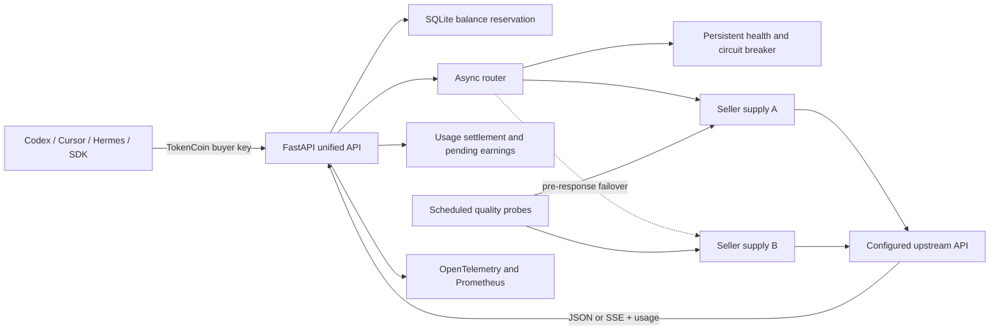

# TokenCoin

TokenCoin 是一个面向 AI API 调用能力的市场基础设施 Demo。卖家接入自己可合法使用的 API 供给，买家只配置一次 TokenCoin 地址和买家 Key；平台负责选源、故障切换、测试账本计费、延迟结算，以及对模型、能力、计量一致性和稳定性的持续抽检。

配置有效 DeepSeek API Key 后，当前版本会请求真实 DeepSeek 上游。未配置时会明确显示 `unconfigured`，不会生成假的模型回答、价格或健康数据。

## 这版验证什么

这版只验证最小闭环：

1. 卖家的厂商 Key 只保存在 TokenCoin 服务端。
2. 买家向一个 OpenAI-compatible 地址发起请求。
3. 网关选择健康货源，并在回答开始前自动尝试备用货源。
4. 平台用语义输出做独立上界，校验上游 usage 是否落在请求前授权范围内，再写入本地测试账本。
5. 卖家收入先进入待结算状态，给质量抽检和争议处理留下时间。
6. 定时探针检查连通性、响应时间、模型标识、随机能力题和用量字段。

它在数据通路上包含 API 网关，但产品目标不止是中转请求。普通中转站主要售卖自己的调用入口；TokenCoin 要管理多个独立供给方，并围绕选源、质量评分、市场计费和延迟结算建立交易规则。

## 已实现的 AI Infra 能力

| 能力 | 当前实现 |
| --- | --- |
| 统一 API | `GET /v1/models`、`POST /v1/chat/completions`、`POST /v1/responses` |
| SSE 流式转发 | 保留上游事件格式；Chat 和 Responses 都能流式传输 |
| 首响应前换源 | 首个有效 SSE `data:` 事件送达买家前，网络错误、限流和 5xx 可切换备用供给 |
| 熔断与恢复 | SQLite 持久化 `healthy / degraded / open / half-open`；带冷却、半开租约和请求代次保护 |
| Token 账本 | 请求前按输入上界和输出上限预授权（含缓冲与最低预留）；最终扣款不能突破该授权；平台只统计正文、推理文本和工具参数；断流按这些语义输出暂估 |
| 延迟收款 | 卖家收入进入 `pending`，账本支持后续 `cleared` 和 `disputed` |
| 质量抽检 | 定时及手动 canary，记录模型一致性、能力一致性、计量一致性、延迟和滚动质量分 |
| 可观测性 | OpenTelemetry FastAPI tracing；Prometheus 请求、Token、延迟、TTFT、换源和熔断指标 |
| 密钥边界 | 买家 Bearer 鉴权；卖家 Key 不进入公开状态、错误正文或追踪属性；响应支持跨 chunk 脱敏 |
| 运维边界 | 会实际调用上游并可能消耗上游余额的 canary 使用独立管理员 Key，并限制人工触发频率 |
| 运维页面 | React 页面只读取后端实时 `/api/status`，后端离线或契约错误时明确显示不可用 |

## 架构



买家侧始终使用同一个地址：

```text
Base URL: http://127.0.0.1:8000/v1
API Key:  项目根目录 .env 中的 TOKENCOIN_BUYER_API_KEY
Model:    deepseek-v4-flash
```

只要客户端允许设置 OpenAI-compatible Base URL，就可以接入这条链路。后台换卖家时，买家无需重新配置。

## 本地启动

需要 Python 3.10+ 和 Node.js 20+。第一次运行：

```powershell
python -m venv .venv
.\.venv\Scripts\python.exe -m pip install -r backend\requirements.txt
npm ci
Copy-Item backend\.env.example .env
```

编辑根目录 `.env`，至少填写：

```dotenv
DEEPSEEK_API_KEY=你的专用 DeepSeek Key
DEEPSEEK_BASE_URL=https://api.deepseek.com
TOKENCOIN_BUYER_API_KEY=一个随机且只给买家的平台Key
TOKENCOIN_ADMIN_API_KEY=另一个只给管理员的随机Key
```

`.env` 已被 Git 忽略。不要把真实 Key 写进源码、README、Issue 或聊天记录。

一键启动前后端：

```powershell
.\scripts\start-demo.ps1
```

然后访问：

- 前端状态页：<http://127.0.0.1:5173>
- 后端接口文档：<http://127.0.0.1:8000/docs>
- 健康检查：<http://127.0.0.1:8000/healthz>
- Prometheus 指标：<http://127.0.0.1:8000/metrics>

## 调用示例

```powershell
$buyerKey = ((Select-String -Path .env -Pattern '^TOKENCOIN_BUYER_API_KEY=').Line -split '=', 2)[1]
$headers = @{ Authorization = "Bearer $buyerKey" }

$body = @{
  model = "deepseek-v4-flash"
  messages = @(@{ role = "user"; content = "只回复 OK" })
  stream = $false
} | ConvertTo-Json -Depth 8

Invoke-RestMethod `
  -Uri http://127.0.0.1:8000/v1/chat/completions `
  -Method Post `
  -Headers $headers `
  -ContentType "application/json" `
  -Body $body
```

手动触发一次上游货源抽检：

```powershell
$adminKey = ((Select-String -Path .env -Pattern '^TOKENCOIN_ADMIN_API_KEY=').Line -split '=', 2)[1]
$adminHeaders = @{ Authorization = "Bearer $adminKey" }

Invoke-RestMethod `
  -Uri http://127.0.0.1:8000/api/probes/run `
  -Method Post `
  -Headers $adminHeaders
```

查询本地 Demo 买家账本：

```powershell
Invoke-RestMethod `
  -Uri http://127.0.0.1:8000/api/ledger/summary `
  -Headers $headers
```

## 多卖家供给

默认的 `DEEPSEEK_API_KEY` 会注册为 `deepseek-default`。额外 OpenAI-compatible 供给通过本地 `.env` 的 `TOKENCOIN_SUPPLIES_JSON` 注册；每项包含 `id`、`name`、`provider`、`base_url`、`api_key`、`models`、`priority` 和 `enabled`。示例见 [`backend/.env.example`](backend/.env.example)。

优先级数字越小越先尝试。每个 Key 仍由对应卖家控制；买家只会看到 TokenCoin buyer key 和统一地址。

## 验证

```powershell
.\.venv\Scripts\python.exe -B -m unittest discover -s backend\tests -v
npm run build
```

测试覆盖买家/管理员鉴权、原子幂等认领、崩溃预留恢复、结算与退款、延迟收入、熔断代次、半开租约、质量评分、Chat/Responses 用量校验、上游协议校验、首响应前换源，以及跨 SSE chunk 的密钥脱敏。CI 配置位于 [`.github/workflows/ci.yml`](.github/workflows/ci.yml)。

## 技术栈

- Python、FastAPI、Pydantic、HTTPX async、Uvicorn
- SQLite WAL、事务账本、幂等请求
- OpenAI-compatible Chat Completions / Responses、SSE
- OpenTelemetry、OTLP、Prometheus
- React、TypeScript、Vite
- Python unittest、GitHub Actions

## 当前边界

- 这是本地技术 Demo，没有真实支付、提现、KYC、合同或厂商授权流程。
- 配置有效 Key 后会注册一个 DeepSeek 供给；多卖家能力已有配置和路由结构，但尚未接入卖家自助开户。
- 账本金额是内部测试余额，单位使用 micro-CNY，不能当作真实资金。
- 每笔预留都有可续期租约；调用期间自动续期，进程异常退出后只回收已经过期的预留。
- usage 缺失、矛盾或明显高于平台观察值时，买家只按平台暂估扣除测试余额；该卖家收益记为争议并立即熔断货源。
- 概率抽检只能降低掺水风险，不能从一次模型输出证明底层模型身份。当前做法综合模型标识、随机挑战题、计量一致性、延迟和历史表现。
- 自动清算编排尚未开放。计量异常会自动记为 `disputed`；其他质量争议仍需人工复核。

## 想法来源与演进

项目最初受 William Yun 关于“不同模型额度汇率、临期额度交换、流动性和模型验真”的讨论启发。经过技术推敲，这个 Demo 先把交易对象收窄为可程序化调用的 API 供给，并把重点放在统一调用、货源检测和延迟结算上。

三篇原始笔记、评论区交流和用户提供的早期建设群聊已整理在 [`docs/william-yun-token-market-research.md`](docs/william-yun-token-market-research.md)。该文区分了作者设想、评论观点、群聊自述和整理者判断。
